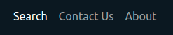

# Search Recipe App

This is a search recipe app that allows users to search for nutritious meals. Application utilizes an API service to
populate the website with recipes. Using the form that contains search bar users can easily query recipes from the API
database and find new interesting recipes to cook.

## UX

### Strategy

- Technical Strategy:
    - I aim to design and build a front-end web application based on the principles of user experience design,
      accessibility and responsivity.
    - I will develop and implement a static front-end web application using HTML, CSS and JS.
    - I will document my code using git tool for better future maintainability.
    - I will deploy the front-end web application using GitHub Pages feature.

- User Strategy:
    - As a user of Search Recipe app, I want to be able to easily search for new recipes without any cognitive overload.
    - As a user of Search Recipe app, I want to be able to view some basic information about recipe without having to
      open a new page.
    - As a user of Search Recipe app, if I am interested in a recipe I want to be able to find out more about the recipe
      by clicking on the recipe associated link.
    - In case of complain or improvement idea I would like to be able to contact the website owner.

### Scope plane:

- Recipe API will provide the user with information about recipes that user has search for.
- Search bar in hero section should be easy to use, allowing user to search for new recipes.
- Navigation bar should be easy to use to navigate website interface.
- On page load Recipe API will populate the main content of the website using data and html template tag.
- On search there should be a loader presented before the data is received and rendered.

### Structure Plane

- User Interface:
    - All Pages:
        - Navigation should contain:
            - links to pages: Search, Contact, About.
            - on mobile devices nav menu should be a drop-down menu with burger icon.
        - Footer should contain:
            - contact information.
            - web app navigation links.
            - social media links.
    - Search Page:
        - Hero section should contain:
            - background image that associates users to food.
            - Bootstrap jumbotron.
            - page heading.
            - call to action
            - form with search input.
        - Main content section should contain:
            - dynamic recipe data generated on page load.
            - dynamic recipe data generated after search.
            - bootstrap card that contains recipe data and reference link.
    - Contact Page:
        - form that has inputs: name, after name, email, text.
    - About Page:
        - main section containing information about the application.

### Skeleton Plane

- Application purpose should be easily seen from the information provided in the hero section.
- Search page should be clear and easy to use without many obstructions.
- About page should give more detailed information about the web application and how to use it.
- Contact form should be easy to use with labeled inputs and example input placeholders.

### Features List

- [x] Responsive navigation bar.
- [x] Responsive footer.
- [x] Search page form input .
- [x] Search page form validation, edge cases: no input, wrong input.
- [x] Data loader on page load and on search.
- [x] Dynamic content on search page using api data.
- [x] Contact page form.
- [ ] Contact form validation.
- [x] About page information.

## Manual Testing

### Testing List

- Testing Responsiveness:
 - [x] Test viewing search page on mobile, tablet, and desktop.
 - [x] Test viewing contact page on mobile, tablet, and desktop.
 - [x] Test viewing about page on mobile, tablet, and desktop.

- Testing Links:
 - [x] Test navigation links on search page.
 - [x] Test navigation links on contact page.
 - [x] Test navigation links on about page.

- Test forms:
 - [x] Test submitting empty search input.
 - [x] Test failed API request.

### Testing Writeup

### Testing Responsiveness
* Every page was opened and viewed using Google Chrome development tool.
 * Each page was viewed on different mobile, tablet and desktop displays.

#### Testing Links
* All navigation links on every page were double tested, making sure that none of them are broken
 * Social network links use target="_blank" attribute to open a new page when clicked.

#### Testing Forms:
* All the forms in this project have a validation system.
 * Submission with blank input is not allowed, message is displayed to inform the user that input section is empty.
 * If api does not respond with data upon request message is showed to the user infoming the user about it.

## Validation

* The HTML validation passes without errors.

* The CSS validation passes without errors.

* CSS Autoprefixer.

* No errors were found when passing through JSHint. 

## Deployment

* This site was deployed to GitHub pages. The steps to deploy are as follows:
    * In the GitHub repository, navigate to the Settings tab.
    * From the source section drop-down menu, select the Main Branch.
    * Once the master branch has been selected, the page will be automatically refreshed with a detailed ribbon
      displayed to indicate the successful deployment.

The live link can be found here - [link](https://maxapn98.github.io/Recipe/)

## Credits

### Content

* Guidance for "How to implement form validation?" was done with the help of
  this [youtube video](https://www.youtube.com/watch?v=In0nB0ABaUk).
* Guidance for "How to implement api call?" was done with the help of
  this [youtube tutorial](https://www.youtube.com/watch?v=zayeU5AOsHI).
* Guidance for HTML template element and JS interaction was done with the help of
  this [youtube tutorial](https://www.youtube.com/watch?v=OSficvLDefM).

### Media

* Photos used in this site development were obtained from [Unsplash.com](https://unsplash.com/).

### Technology

* CSS library used in this project [Bootstrap.com](https://getbootstrap.com/).
* API used for this project [Edamam.com](https://www.edamam.com/).